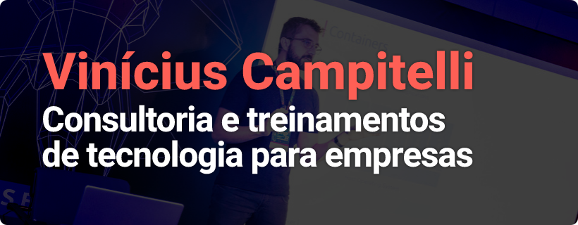

### Consultoria e treinamentos para empresas sobre:

* Arquitetura de sistemas
* Boas práticas
* Cibersegurança
* DevOps, CI/CD
* Docker, Kubernetes
* Linux
* Microsserviços
* Testes
* E muitos outros assuntos!

Se interessou? Entre em contato comigo!

# Palestras

    <a href="https://viniciuscampitelli.com/slides-webauthn">
        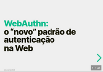
    </a>
    
    
    
    <a href="https://viniciuscampitelli.com/workshop-kubernetes">
        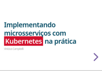
    </a>
    <a href="https://viniciuscampitelli.com/slides-comunicacao-microsservicos">
        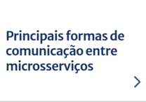
    </a>
    
    
    <a href="https://viniciuscampitelli.com/vault">
        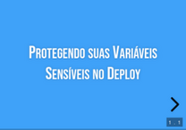
    </a>
    <a href="https://viniciuscampitelli.com/slides-apis-seguras">
        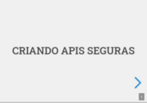
    </a>
    
    <a href="https://viniciuscampitelli.com/slides-libsodium-php">
        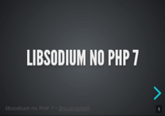
    </a>
    
    <a href="https://viniciuscampitelli.com/slides-php-fora-da-web">
        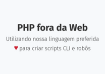
    </a>
    <a href="https://viniciuscampitelli.com/slides-mecanismos-autenticacao-seguros">
        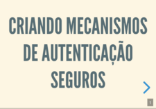
    </a>
    
    <a href="https://viniciuscampitelli.com/slides-criptografia-php">
        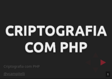
    </a>
    <a href="https://viniciuscampitelli.com/slides-expressive-oauth2-jwt">
        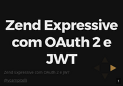
    </a>
    

