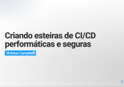
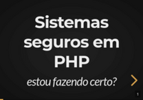

> Desenvolvedor há mais de 15 anos, já atuei em projetos em diversas áreas, como email marketing, automação de redes, e-commerce, cibersegurança e e-learning, onde inclusive fundei uma startup.

### Consultoria e treinamentos de tecnologia para empresas sobre:

* 🏛️ Arquitetura de sistemas
* 🔷 Boas práticas
* 🛡️ Cibersegurança
* ♾️ DevOps e CI/CD
* 🐳 Docker e Kubernetes
* 🐧 Linux
* 📦 Microsserviços
* 🧪 Testes
* *️⃣ Assuntos sob demanda

Se interessou?

Ou entre em contato:

# Palestras

    
    
    
    
    
    
    
    
    
    
    
    
    
    
    
    
    
    
    
    
    

